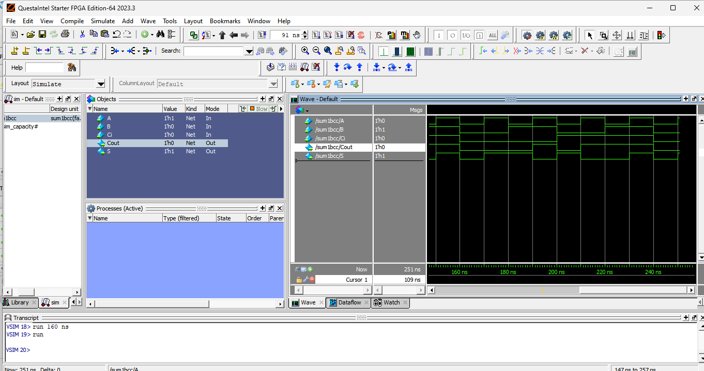

# lab01- sumador 
## nombres
Paula Mariana Ruiz Constante
## informe de laboratorio 
### sumador 

- **`sum1bcc_primitive.v`**:  
  Este módulo implementa un sumador completo utilizando puertas lógicas (`and`, `xor`, `or`). La salida `S` representa la suma de los bits de entrada (`A`, `B`, `Ci`), mientras que `Cout` es el acarreo resultante. Es un diseño puramente combinacional.  

- **`sum1bcc.v`**:  
  Este módulo implementa el mismo sumador completo, pero utiliza un registro (`reg`) para almacenar temporalmente las salidas. Se basa en la operación aritmética `A + B + Ci`, asignando la suma a `S` y el acarreo a `Cout`. Es un diseño más abstracto y compacto.  

#### Diferencias entre las descripciones  
La implementación de `sum1bcc_primitive.v` se realiza a nivel de puertas lógicas, lo que permite observar la lógica básica del sumador completo. En contraste, `sum1bcc.v` utiliza un registro para manejar las salidas, reduciendo la complejidad del diseño. Además, `sum1bcc_primitive.v` requiere más recursos lógicos, mientras que `sum1bcc.v` puede ser más eficiente dependiendo del sintetizador.

### **Entregables 1**  
- Se incluyeron los códigos HDL de los módulos `sum1bcc_primitive.v` y `sum1bcc.v` en la carpeta **`src`**, con los respectivos comentarios que explican línea por línea el funcionamiento de cada módulo.
### **Entregables 2**  
- Se creó un nuevo proyecto en Quartus donde el módulo `sum1bcc` fue configurado como el archivo **top-level**. El diseño se sintetizó correctamente, verificando que el sumador funcionara como se esperaba.  
- En la carpeta **`figs`**, se incluyó una captura de la implementación del proyecto en Quartus.
### **Entregables 3**  
- Se realizó la simulación en Questa Sim para validar todas las combinaciones posibles de las entradas `A`, `B` y `Ci`. Las capturas de las simulaciones se encuentran en la carpeta **`figs`**.  
- El análisis de la simulación muestra que el sumador funciona correctamente:
  - Para todas las combinaciones de `A`, `B` y `Ci`, el resultado de la suma (`S`) corresponde al comportamiento esperado de una suma binaria con acarreo.
  - El acarreo de salida (`Cout`) también aparece correctamente cuando la suma excede un bit.  
  - La simulación comprueba que el diseño funciona como un sumador completo.

#### Resultados de la simulación  
A continuación, se presenta una captura de la simulación:  

